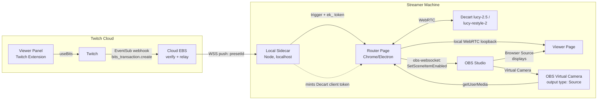

# Reality Hijack — MVP Feasibility Assessment & Implementation Plan

**Date:** 2026-07-20 · **Status:** Pre-build assessment (research-verified against live docs)

## Verdict

**Feasible, with two architecture corrections and one pricing correction.** Every load-bearing capability was verified against current documentation: Decart's `lucy-2.5` realtime model exists and streams over WebRTC via `@decartai/sdk` ($0.02/sec); the OBS Virtual Camera is a standard camera device visible to `getUserMedia()` on macOS 13+ (OBS 30+); obs-websocket v5 supports the exact visibility toggle the design needs; and the Twitch Bits-in-Extensions flow is testable pre-review at zero cost.

The corrections:

1. **The capture point cannot be an OBS Browser Source, and the Local Video Router cannot be a plain Node script.** Both assumptions in the original spec fail — see §2.
2. **Free-text viewer prompts are banned by Twitch policy** (Extension Guideline §6.2.8), which converts the "prompt guardrails" feature from a nice-to-have into the compliance-mandated core of the product — see §5.
3. **At 300 bits, the developer share does not cover Decart's cost.** The unit economics only work at higher SKU prices or with the cheaper `lucy-restyle-2` model — see §4.

---

## 1. Verified facts (with implications)

| Claim in spec | Verified reality | Implication |
|---|---|---|
| "Decart AI Lucy 2.5 Realtime API" | Real: model ID `lucy-2.5`, 720p, WebRTC media transport (LiveKit-backed), `@decartai/sdk` on npm. Cheaper sibling `lucy-restyle-2` ($0.01/s) is purpose-built for realtime restyling. | For environment restyling ("Lava Room"), `lucy-restyle-2` may be the better model *and* halves COGS. Benchmark both in Phase 0. |
| "Bills by the second" | Confirmed: $0.02/sec (`lucy-2.5`), $0.01/sec (`lucy-restyle-2`). Free credits on signup. | 60s burst = $1.20 or $0.60 COGS. |
| API auth from the browser | Raw API keys (`dct_…`) are **forbidden in client code** by Decart policy. Realtime sessions must use short-lived client tokens (`ek_…`) minted server-side, with configurable TTL **and a `maxSessionDuration` cap**. | A small local token-minting server is required. `maxSessionDuration` is a gift: set it to ~75s and Decart's *server* kills the session even if our client hangs — the strongest possible cost-control guarantee. |
| "Capture OBS Virtual Camera via getUserMedia" | Works in Chrome/Electron on macOS 13+ (OBS 30+ ships a CoreMediaIO camera extension; one-time system approval). `localhost` is a secure context, so plain HTTP is fine. | ✅ as designed — but only in a real browser, not OBS's embedded one. |
| Run the router page inside OBS Browser Source | **Fails.** OBS's CEF has no camera-permission UI; `getUserMedia` silently rejects. Workaround flags (`--enable-media-stream`) are undocumented and unverified on OBS 30/31. | Capture must run in a Chrome tab or Electron app. The Browser Source becomes **display-only** (receiving WebRTC video needs no permissions — the proven VDO.Ninja pattern). |
| OBS webcam hardware lock | Real, and there's a second trap: Virtual Camera defaults to outputting **Program** (the composited scene), so the AI overlay would feed back into its own input. | Set Virtual Camera output type to **Source** (the raw camera source) — an official OBS feature since v26. Documented setup step, not code. |
| obs-websocket toggle | Confirmed: `GetSceneItemId` + `SetSceneItemEnabled` (obs-websocket v5, built into OBS 28+; `obs-websocket-js` v5.x, works from browser JS). | ✅ as designed. Can run directly in the router page — no Node needed for this. |
| Bits webhook to EBS | Two paths: frontend `onTransactionComplete` receipt JWT (forwarded to EBS, verified with the Extension Secret) and EventSub webhook `extension.bits_transaction.create` (webhook/conduit only). | Use **EventSub as the source of truth** for triggering the hijack (viewers can't forge it); use the frontend receipt only for optimistic UI. |
| Testing requires review? | No. Bits flow works pre-review on your own channel in Local/Hosted Test state **without spending real Bits**. Twitch CLI can mock the EventSub event (`twitch event trigger extension.bits_transaction.create`). Developer Rig is dead (EOL Jan 2023) — Console + CLI is the current path. | Full end-to-end demo is achievable without passing review — ideal for a portfolio project. |

## 2. Corrected architecture

The four-module split survives; the *runtime placement* changes. The "Local Video Router" becomes a localhost web app (page + tiny Node sidecar), and the OBS Browser Source becomes a passive viewer.



**Module responsibilities (revised):**

- **A. Cloud EBS** (unchanged role): verifies EventSub signatures / receipt JWTs, maps SKU → preset ID, pushes `{presetId, transactionId, username}` over an outbound WebSocket the sidecar opened. Never sends prompt text.
- **B. Twitch Panel** (unchanged): preset picker (fixed SKUs), `useBits()`, "celebrate"-compliant copy (§6.5 bans "buy/purchase/donate" language).
- **C. Local Router** — now two pieces:
  - *Sidecar (Node, ~100 lines):* serves the pages over `http://localhost`, holds the `dct_` Decart key and mints `ek_` client tokens with `maxSessionDuration ≈ 75s`, maintains the WS to the EBS, relays loopback-WebRTC signaling between the two pages.
  - *Router page (browser):* `getUserMedia` on "OBS Virtual Camera" → `client.realtime.connect(stream, {model, initialState:{prompt}})` → pipes the returned `MediaStream` over a local `RTCPeerConnection` to the viewer page → runs the state machine → drives obs-websocket.
- **D. Viewer page** (new, trivial): receives the loopback stream, renders full-bleed `<video>`. This is what the OBS Browser Source loads. Receiving WebRTC video requires no permissions, so it works inside OBS's CEF.

**MVP shortcut option:** skip the loopback pages entirely and have OBS *Window Capture* the router page's video element (toggled with the same `SetSceneItemEnabled`). Less elegant (window chrome, must stay open on-screen) but removes the signaling code — a legitimate Phase-1 stepping stone before building the loopback in Phase 2/3.

## 3. The 60-second state machine (hardened)

The spec's 4 states are right but have no failure paths, and `onloadeddata` is the wrong buffer signal — a WebRTC stream can fire it while still emitting black/garbage frames. Use `requestVideoFrameCallback` and require N real decoded frames.

```
IDLE ──trigger──▶ AUTHORIZING ──ek_ token──▶ CONNECTING ──▶ BUFFERING ──▶ LIVE ──▶ TEARDOWN ──▶ IDLE
                      │ mint fails            │ >10s timeout   │ >8s no frames  │ 60s timer,
                      ▼                       ▼                ▼                │ or any error,
                   ABORT (never unhide) ◀─────┴────────────────┘                ▼
                                                                            TEARDOWN
```

- **BUFFERING → LIVE:** unhide the Browser Source only after ~10 consecutive `requestVideoFrameCallback` ticks on the AI `<video>`. Never show a black screen.
- **TEARDOWN (idempotent, runs on: timer=0, any error, WS drop, page unload):** hide Browser Source **first**, then `realtimeClient.disconnect()`, then `stream.getTracks().forEach(t => t.stop())`.
- **Cost control, three layers:** (1) the 60s timer, (2) a 70s local watchdog, (3) the token's `maxSessionDuration=75s` — Decart's server ends the session even if the whole local machine freezes. Worst case overrun: 15 seconds = $0.30.
- **Concurrent purchases:** serialize into a FIFO queue (EBS-side, so the panel can show "3 hijacks queued"). Do not extend an active session — queued bursts are simpler to reason about and each gets its clean init/teardown.
- **Failed hijack after payment:** Bits are non-refundable. Product answer: EBS marks the transaction `failed`, panel shows "effect failed — you keep priority, it will retry when the streamer's rig reconnects." Log everything; this is the #1 support surface.
- **Polish note for the demo:** the AI feed lags the raw camera by whatever Decart's glass-to-glass latency is (unpublished for Lucy 2.5 — measure in Phase 0). The swap will show a visible time-jump. Cover both transitions with a ~400ms glitch/static wipe in the viewer page — it turns the artifact into the product's signature moment.

## 4. Unit economics (correction)

Bits pay out ~$0.01/bit into a pool split **80% streamer / 20% developer** (widely reported; not stated on the current primary doc — verify in the dev console). The developer pays Decart. So:

| SKU price | Dev share (20%) | COGS `lucy-2.5` (60s) | COGS `lucy-restyle-2` (60s) | Dev margin (restyle) |
|---|---|---|---|---|
| 300 bits | $0.60 | $1.20 ❌ | $0.60 ⚖️ break-even | $0.00 |
| 500 bits | $1.00 | $1.20 ❌ | $0.60 | +$0.40 |
| 750 bits | $1.50 | $1.20 ✅ | $0.60 | +$0.90 |

- **Recommendation:** MVP on `lucy-restyle-2` at **500 bits/hijack** (streamer nets $4.00, dev nets $0.40). Reserve `lucy-2.5` for a premium 1000-bit tier (character swaps, object edits) where the margin supports it.
- **Alternative model worth documenting in the portfolio:** BYOK — the streamer supplies their own Decart key via the config panel; the dev share becomes pure margin and the streamer's net at 300 bits is still positive ($2.40 − $0.60). More setup friction, radically better dev economics.

## 5. Prompt guardrails — design

Research surfaced the decisive constraint: **Twitch Extension Guideline §6.2.8 prohibits Bits products defined by free-form user input** (explicitly calls out blank text fields vs. pre-populated menus). Separately, **Decart has no confirmed pre-generation content filter** — its AUP puts moderation responsibility on the integrator. So guardrails aren't a threshold-tuning problem; they're an architecture:

**Layer 0 — No viewer-authored prompts (MVP, mandatory).** Viewers pick from a fixed catalog of presets ("Lava Room", "Underwater", "80s Anime"). Prompt strings live server-side, keyed by preset ID; the wire payload from EBS → local machine carries only the ID. The viewer never controls a single character of the prompt → prompt injection is structurally impossible, and the product passes review. This reframes the feature for your portfolio: *the safest guardrail is a data model where untrusted text never exists.*

**Layer 1 — Streamer-defined range (MVP, the "streamer sets permitted stuff" ask).** In the extension's broadcaster-config view:
- per-preset enable/disable (the streamer curates their own catalog subset);
- category toggles (environments / characters / horror / chaotic) and an intensity ceiling (mild → wild), which filter which presets appear in the panel;
- rate limits: cooldown between hijacks, max hijacks/hour, queue depth cap;
- **panic button**: a hotkey/chat-command that fires TEARDOWN immediately and pauses the queue. Non-negotiable for streamer trust — the streamer's face and room are the canvas.

**Layer 2 — Free-text tier (post-MVP, explicitly out of scope for the Bits extension).** If ever built, it cannot ship through Bits (§6.2.8) — it would ride on Channel Points or an off-extension tip flow. Pipeline: blocklist → cheap LLM moderation classifier scored against the streamer's Layer-1 settings → streamer approve/reject queue (which Guideline §7 requires for user-submitted content anyway, with the submitter's username displayed) → Decart. Documenting this as a deliberately-deferred tier is itself a good product-judgment artifact.

## 6. Risks

| Risk | Severity | Mitigation |
|---|---|---|
| **May 2026 Bits AUP rewrite**: "Bits may not be used for functionality or experiences outside Twitch." A companion-app-rendered effect is ambiguous; the policy's own allowed example (Bits changing a game character's speed, rendered locally, visible on stream) suggests on-stream effects are fine, but there's no precedent yet. | High (for public release), Low (for portfolio demo — local test mode doesn't need review) | Get written clarification from Twitch dev support before any review submission. For the portfolio, note the risk and the mitigation — that's the product-thinking artifact. |
| Decart latency unpublished for Lucy 2.5 ("near-zero" marketing; <40ms claimed only for predecessor MirageLSD) | Medium | Phase 0 benchmark with free credits before committing to UX promises. |
| Unknown whether EventSub fires for test-mode (zero-cost) Bits transactions | Medium | Twitch CLI mock events cover EBS testing regardless; verify live behavior in hosted test. |
| OBS CEF quirks in the viewer page (older Chromium) | Low | Viewer page is deliberately dumb — one `<video>` + one `RTCPeerConnection`. |
| Chrome caps "OBS Virtual Camera" at 1080p (open OBS issue) | None for MVP | Decart wants 720p anyway. |

## 7. Revised milestones

**Phase 0 — Spikes (½–1 day).** Decart free-credit account; confirm OBS Virtual Camera appears in Chrome `enumerateDevices()` on this Mac (OBS 30+, macOS 13+, one-time extension approval); measure Decart glass-to-glass latency with the SDK quickstart; set Virtual Camera output type to Source. *Gate: kills or confirms the whole concept for <$1.*

**Phase 1 — Capture + OBS control (1–2 days).** Sidecar serving the router page on localhost; `getUserMedia` the virtual camera; obs-websocket connect + `GetSceneItemId`/`SetSceneItemEnabled` toggle from a debug button. (The spec's "Node script captures the camera" is replaced by this — Node cannot call `getUserMedia`.)

**Phase 2 — Decart bridge + loopback (2–3 days).** Sidecar mints `ek_` tokens (`maxSessionDuration` set); router connects the camera stream to `lucy-restyle-2` and `lucy-2.5`; loopback RTCPeerConnection to the viewer page; viewer page into the OBS Browser Source. *Interim shortcut allowed: Window Capture of the router page.*

**Phase 3 — State machine (2 days).** Full hardened state machine from §3, including frame-verified buffering, idempotent teardown, watchdog, queue, transition wipe. Test the failure paths deliberately (kill Wi-Fi mid-burst, kill OBS mid-burst).

**Phase 4 — Twitch EBS + panel (3–4 days).** EBS (any small host + WSS) with EventSub verification; sidecar's outbound WS to EBS; panel with preset catalog + `useBits`; Bits products (SKUs) in the dev console; end-to-end via Twitch CLI mock events, then Local Test on your own channel with zero-cost Bits.

**Phase 5 — Guardrail config + polish (2–3 days).** Broadcaster config view (Layer 1 controls), panic button, queue display in panel, demo script/video for the portfolio.

Roughly **2–3 weeks part-time** to a demoable MVP; total API spend well under $10.

## 8. Platform alternatives (added 2026-07-20)

The policy friction lives specifically in the **Twitch Extension + Bits** path (extension review, §6.2.8 free-text ban, Bits AUP ambiguity) — not in Twitch itself, and not in triggering on-stream effects generally. Verified trigger mechanisms, ranked by MVP fit:

| Option | Money | Public server needed | Review needed | Free-text prompts | Verdict |
|---|---|---|---|---|---|
| **Twitch Channel Points** (EventSub *WebSocket*, `channel_points_custom_reward_redemption.add`) | Engagement currency only | **No** — local app connects outbound with broadcaster token (`channel:read:redemptions`) | No (self-service) | **Yes** — `user_input` field, rewards created with `is_user_input_required` | ✅ MVP — but ⚠️ **requires Affiliate/Partner channel**; demo via Twitch CLI mock events otherwise |
| **Streamlabs tips** (outbound Socket API WS) | Real money (streamer's Stripe/PayPal) | No | No (dashboard token) | Yes (`message` field) | ✅ **MVP primary real-money trigger** — works on ANY Twitch account (no Affiliate gate), matches the donation-TTS pattern viewers already know, enables a real live end-to-end demo. Prefer over StreamElements (whose JWT rotates 2-weekly) |
| **Twitch Bits cheers in chat** (EventSub WS `channel.cheer`, scope `bits:read`) | Real money (Bits, streamer keeps ~$0.01/bit — no 80/20 dev split) | No | No — this is the streamer's own tooling reacting to chat, the exact pattern the Bits AUP's allowed examples describe (donation-TTS precedent) | Yes — cheer message text included in event | ✅ Twitch-native real-money path — but ⚠️ **cheering only works on Affiliate/Partner channels**; same CLI-mock caveat as Channel Points |

**Trigger-layer design:** all sources normalize to one pluggable event shape — `{source, amount, message, username}` — feeding the same guardrails pipeline and state machine. MVP ships two adapters: **Streamlabs** (live-demoable on any account) and **Twitch EventSub** (Channel Points + cheers; live on Affiliate channels, CLI-mocked otherwise). StreamElements/YouTube/Kick become later adapters against the same interface.
| **YouTube Super Chat** (`liveChatMessages` polling or gRPC `streamList`, `superChatDetails.userComment`) | Real money | No | Google OAuth verification at public scale; fine for own-channel testing | Yes | ⚠️ Viable; explicitly sanctioned by Google's third-party Super Chat integration policy, but quota costs unverified |
| **Kick** (`kicks.gifted` webhook) | Real money | **Yes** — webhook-only, no WS transport confirmed; needs tunnel/relay | No formal review | Unconfirmed for gifts | ⚠️ Defer — immature API, breaks local-only design |
| **Ko-fi** (webhooks) | Real money | Yes (webhook) | No | Yes | ⚠️ Same tunnel problem |
| **TikTok Live** (gifts) | Real money | No | **No official API exists** — only reverse-engineered libraries (TikTok-Live-Connector), material ToS/ban risk | — | ❌ Avoid for a portfolio product |
| Twitch Bits Extension (original plan) | Real money, 80/20 split | Yes (EBS + EventSub webhook) | Extension review + Bits AUP | **Banned** (§6.2.8) | 📦 Phase-2 monetization tier |

**Recommended MVP pivot — Channel Points first:**

- **The cloud EBS disappears entirely.** The local sidecar opens an outbound WebSocket to `wss://eventsub.wss.twitch.tv/ws` with the broadcaster's own token and subscribes to redemption events. Zero hosted infrastructure, zero review, works today. Phase 4 shrinks from 3–4 days to ~1 day.
- **Free-text prompts become legal**, which means the guardrails feature — the AI-product-design centerpiece of the portfolio — becomes *demonstrable* instead of moot: viewer redeems "Reality Hijack" with typed input → blocklist → LLM moderation classifier scored against streamer's category/intensity settings → (optional) streamer approve queue → Decart. Keep the preset catalog as the default tier and free-text as the premium redemption.
- **Monetization story stays intact for the portfolio:** channel points drive engagement (indirect revenue), Streamlabs/StreamElements tip triggers add a real-money path with ~2 hours of work (same event-driven sidecar, second socket), and the Bits extension remains documented as the platform-native monetization phase with its compliance-driven design differences (preset-only, EBS, review). Showing *why* each tier has a different guardrail model is stronger product-design evidence than the Bits path alone.

**Policy notes:** Channel Points AUP only bans cash-value/gambling redemptions — local visual effects are normal engagement use. Google explicitly sanctions third-party tools that "offer fun interactions when your viewers buy Super Chats." These are supported integration paths, not workarounds.
