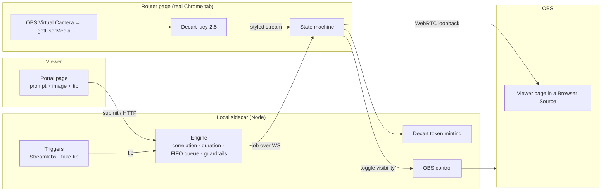

# Reality Hijack

**Viewers pay to remix a streamer's reality in real time.** A viewer tips, types a
prompt (or picks a preset) and optionally drops in a reference image — and the
streamer's live webcam is restyled by a realtime AI video model for a number of
seconds proportional to the tip (**$1 = 1 second**), then snaps back to normal.

This repo is a working MVP **and** a case study in designing an AI product
around real-world constraints: per-second GPU billing, platform monetization
policy, live-video latency, and content safety. The engineering decisions and
the *product* decisions are documented together, on purpose — see
[`FEASIBILITY.md`](./FEASIBILITY.md) for the full research-backed assessment that
shaped every choice below.

> **Runs with zero credentials.** With no API keys configured, the whole
> pipeline runs in **MOCK mode** (camera passthrough) so you can see the tip →
> queue → timed-effect → revert loop end-to-end for free, then drop in real keys
> to light up the actual AI restyle.

---

## What makes this interesting (the product-design story)

Most "AI demo" projects wire a model to a UI. The hard and interesting parts
here are the constraints *around* the model:

| Constraint | Why it's hard | How the product solves it |
|---|---|---|
| **Per-second GPU cost** | The realtime model bills by the second; a hung session burns money. | Three independent cost caps: a countdown timer, a local watchdog, and a Decart **client token whose `maxSessionDuration` lets Decart's own servers kill the session** even if the streamer's machine freezes. Worst-case overrun is bounded to seconds. |
| **Content safety** | Viewers control the prompt; the model has no built-in pre-generation filter. | Prompt text is **resolved server-side from a preset id** (viewers never send raw bytes for presets), and custom free-text runs through a moderation gate scored against **streamer-configurable** guardrails. Untrusted text is structurally contained. |
| **Monetization policy** | Twitch's Bits/Extensions rules *ban* free-text paid products and require review. | The trigger layer is **platform-agnostic** (`{source, amount, message, username}`). MVP uses Streamlabs tips (no review, works on any account); Twitch Channel Points/cheers are drop-in adapters. See the decision trail in `FEASIBILITY.md` §8. |
| **Live-video latency** | The AI feed lags the raw cam; a naive cut looks broken. | A glitch-wipe covers each transition, and OBS is unhidden **only after the viewer page confirms real decoded frames** — never a black screen. |
| **Hardware locks** | OBS already owns the webcam; browsers can't grab a locked device. | Capture the **OBS Virtual Camera** (output set to *Source* to avoid a feedback loop) from a real Chrome tab — because OBS's embedded browser blocks camera permission. |

## Architecture

Five processes on one machine. No cloud backend — the "server" is a local
sidecar the streamer runs.



**Data flow of one hijack:** viewer submits a prompt+image → gets a short claim
code → tips with the code in the message → the sidecar matches tip↔submission,
computes duration, and queues a job → the router mints a duration-capped token,
opens Decart, waits for verified frames, unhides the OBS source, counts down,
then tears everything down cleanly.

### The state machine (per job)

```
IDLE → AUTHORIZING → CONNECTING → BUFFERING → LIVE(duration) → TEARDOWN → IDLE
         mint fail / >10s connect / >8s no frames → ABORT (OBS never unhidden)
         any error / panic / watchdog → idempotent TEARDOWN
```

Teardown always hides the OBS source *before* dropping the Decart session, is
idempotent, and runs on every exit path (timer, error, panic, page unload).

## Repository layout

```
shared/     Types + WebSocket protocol + preset catalog (one source of truth)
sidecar/    Node/Express + ws hub · engine (money logic) · triggers · Decart
            token minting · server-side OBS control · guardrails
web/        Vite + React + Tailwind — three routes:
              /portal   viewer UI (prompt, image, claim code, live status)
              /router   streamer capture + state machine + guardrail settings
              /viewer   dumb display page loaded inside an OBS Browser Source
FEASIBILITY.md   The research + product assessment that drove the design
```

## Run it

```bash
npm install
cp .env.example .env      # leave keys blank to run in MOCK mode
npm run dev               # sidecar :7712 + web :5173
```

Then, in a browser:

1. Open **http://localhost:5173/router** and click **Arm camera**.
2. Open **http://localhost:5173/portal**, pick an effect (or write a prompt),
   optionally add an image, and click **Get my claim code**.
3. Click **Send $N test tip** — watch the router run the job for N seconds.

For the real thing (AI restyle + OBS overlay + real tips), follow the
credential + hardware setup in [`docs/PHASE0.md`](./docs/PHASE0.md).

## Status

MVP complete and verified: full tip → queue → timed-effect → revert loop, with
guardrails, cost caps, and the OBS loopback. Runs in MOCK mode today; drop in a
Decart key and OBS to go live. Roadmap (see `FEASIBILITY.md`): Twitch Channel
Points/cheers adapters, LLM prompt moderation, and the Twitch Bits Extension as
a platform-native monetization tier.

---

*Built as a portfolio project to demonstrate end-to-end AI product design —
from API feasibility research through a working, cost-safe, policy-aware
implementation.*
