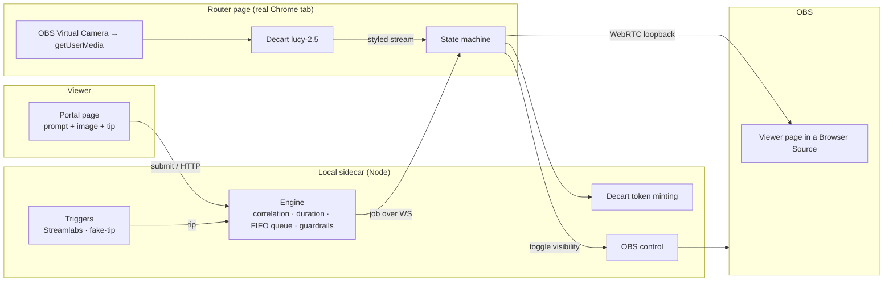

# Reality Hijack

**Viewers pay to remix a streamer's reality in real time.** A viewer tips, types a
prompt (or picks a preset) and optionally drops in a reference image — and the
streamer's live webcam is restyled by a realtime AI video model for a number of
seconds proportional to the tip (**$1 = 1 second**), then snaps back to normal.

This repo is a working MVP **and** a case study in designing an AI product
around real-world constraints: per-second GPU billing, platform monetization
policy, live-video latency, and content safety. The engineering decisions and
the *product* decisions are documented together, on purpose — see
[`FEASIBILITY.md`](./FEASIBILITY.md) for the full research-backed assessment that
shaped every choice below.

> **Runs with zero credentials.** With no API keys configured, the whole
> pipeline runs in **MOCK mode** (camera passthrough) so you can see the tip →
> queue → timed-effect → revert loop end-to-end for free, then drop in real keys
> to light up the actual AI restyle.

---

## Why this exists — the economic case for *paid* reality hijacks

Real-time generative video is finally cheap enough to be *interactive* — but not
cheap enough to leave *running*. Decart's `lucy-2.5` realtime model bills
**$0.02/sec — about $1.20/min, ~$72/hr**
([fal](https://fal.ai/lucy-2.5), [Decart pricing](https://docs.platform.decart.ai/getting-started/pricing)).
No streamer is going to pay $72/hr out of pocket to keep an AI filter on their
scene as decoration; as an always-on cosmetic, the unit economics are underwater.

**The fix isn't a cheaper model — it's changing who pays, and when.** Reality
Hijack never runs the model on the streamer's dime or on a timer. Every hijack is
*triggered and funded by a viewer*, billed by the second, and lasts only as long
as the payment bought (**$1 = 1 second** in this MVP). GPU cost scales with
*revenue*, not with airtime: a hijack costs cents, and the tip that fired it
covers those cents many times over — at the MVP's $1/sec the viewer pays roughly
**50× the GPU cost** of the seconds they buy. The math only closes **inverted** —
viewer-funded and bursty, never streamer-funded and continuous.

And that behavior isn't something we have to teach. The creator economy has spent
a decade training viewers to **pay to affect the streamer** — Twitch Bits,
Streamlabs tip TTS, Blerp / DonationAlerts media-share
([Streamlabs](https://streamlabs.com/donations)), and above all **Crowd
Control**: 70,000+ creators whose viewers spend Bits/Coins to mess with the
streamer's *game*
([Twitch blog](https://blog.twitch.tv/en/2019/02/15/the-evolution-of-speedrunning-crowd-control-caf6e259e848/),
[TechCrunch](https://techcrunch.com/2023/05/01/crowd-control-interactive-stream/)).
Reality Hijack points that same proven loop at a surface the game-only tools
can't reach — the streamer's **camera and scene** — and opens two wedges:

- **Comedy / chaos.** Reaction content is the native currency of live streaming;
  viewers already pay to make creators react (see the whole
  [IShowSpeed AI-face-filter](https://www.youtube.com/watch?v=k00gPbvmr2w)
  reaction genre). A live, paid restyle of the streamer's entire reality is a new
  lever on that engine.
- **Paid brand activations.** A sponsor buys 30 seconds of the scene turned *into
  their world* — a drink brand floods the room, a game studio drops the streamer
  into their setting. A native, on-stream, hard-to-skip ad unit, priced per second.

> **One-line thesis:** as a scene-decoration tool this is a money pit; as a
> **per-second, viewer-funded interaction** it rides a monetization loop already
> worth billions and adds a canvas — the streamer's face and room — that Crowd
> Control never touched.

---

## What makes this interesting (the product-design story)

Most "AI demo" projects wire a model to a UI. The hard and interesting parts
here are the constraints *around* the model:

| Constraint | Why it's hard | How the product solves it |
|---|---|---|
| **Per-second GPU cost** | The realtime model bills by the second; a hung session burns money. | Three independent cost caps: a countdown timer, a local watchdog, and a Decart **client token whose `maxSessionDuration` lets Decart's own servers kill the session** even if the streamer's machine freezes. Worst-case overrun is bounded to seconds. |
| **Content safety** | Viewers control the prompt; the model has no built-in pre-generation filter. | Prompt text is **resolved server-side from a preset id** (viewers never send raw bytes for presets), and custom free-text runs through a moderation gate scored against **streamer-configurable** guardrails. Untrusted text is structurally contained. |
| **Monetization policy** | Twitch's Bits/Extensions rules *ban* free-text paid products and require review. | The trigger layer is **platform-agnostic** (`{source, amount, message, username}`). MVP uses Streamlabs tips (no review, works on any account); Twitch Channel Points/cheers are drop-in adapters. See the decision trail in `FEASIBILITY.md` §8. |
| **Live-video latency** | The AI feed lags the raw cam; a naive cut looks broken. | A glitch-wipe covers each transition, and OBS is unhidden **only after the viewer page confirms real decoded frames** — never a black screen. |
| **Hardware locks** | OBS already owns the webcam; browsers can't grab a locked device. | Capture the **OBS Virtual Camera** (output set to *Source* to avoid a feedback loop) from a real Chrome tab — because OBS's embedded browser blocks camera permission. |

## What a hijack looks like — the effect catalog

Viewers never type raw prompts for presets; they tap a **card**, and the prompt
is resolved server-side by id (the safety model — see *Architecture*). The MVP
ships six cards, and the emoji below is the actual thumbnail the portal renders.

| Card | What the viewer taps | The prompt it fires (server-side) | Intensity |
|---|---|---|---|
| 🌋 | **Lava Room** | *"…the entire room is flooded with molten lava, glowing orange cracks across the floor and walls, embers floating…"* | 4 / 5 |
| 🌊 | **Underwater** | *"…the room is submerged deep underwater, shafts of blue light from above, drifting bubbles, caustic reflections…"* | 2 / 5 |
| 📼 | **80s Anime** | *"…retro 1980s anime cel-shaded style, bold ink outlines, neon sunset gradients, film grain, VHS palette…"* | 3 / 5 |
| 🌃 | **Cyberpunk City** | *"…neon cyberpunk cityscape backdrop, holographic signs, rain-slicked reflections, teal and magenta lighting…"* | 3 / 5 |
| 👻 | **Haunted** | *"…eerie haunted scene, desaturated cold tones, creeping shadows, ghostly mist, flickering candlelight…"* | 4 / 5 |
| ❄️ | **Winter Wonderland** | *"…a magical snowy winter wonderland, soft falling snow, frost on every surface, warm golden fairy lights…"* | 1 / 5 |

Custom free-text is a separate, streamer-gated tier that runs through moderation
(see *Architecture → guardrails*).

**The closest things that exist today** — what a live hijack would read like on
stream, from real footage:

- Decart's own [MirageLSD demos](https://decart.ai/publications/mirage) restyle
  live *gameplay* into a snowy wonderland or anime worlds in real time — the same
  model family, pointed at a game feed instead of a webcam.
- The [IShowSpeed AI-face-filter](https://www.youtube.com/watch?v=k00gPbvmr2w)
  reaction clips capture the audience appetite: transform the streamer live and
  watch them react.
- [Crowd Control](https://crowdcontrol.live/) is the paid-interaction loop this
  borrows — one surface over (their game vs. our scene).

> Real before/after camera captures belong here, and will be added from an actual
> live Decart session — deliberately **not** mocked up, so nothing in this README
> is a fabricated screenshot.

---

## Architecture

Five processes on one machine. No cloud backend — the "server" is a local
sidecar the streamer runs.



**Data flow of one hijack:** viewer submits a prompt+image → gets a short claim
code → tips with the code in the message → the sidecar matches tip↔submission,
computes duration, and queues a job → the router mints a duration-capped token,
opens Decart, waits for verified frames, unhides the OBS source, counts down,
then tears everything down cleanly.

### The state machine (per job)

```
IDLE → AUTHORIZING → CONNECTING → BUFFERING → LIVE(duration) → TEARDOWN → IDLE
         mint fail / >10s connect / >8s no frames → ABORT (OBS never unhidden)
         any error / panic / watchdog → idempotent TEARDOWN
```

Teardown always hides the OBS source *before* dropping the Decart session, is
idempotent, and runs on every exit path (timer, error, panic, page unload).

## Repository layout

```
shared/     Types + WebSocket protocol + preset catalog (one source of truth)
sidecar/    Node/Express + ws hub · engine (money logic) · triggers · Decart
            token minting · server-side OBS control · guardrails
web/        Vite + React + Tailwind — three routes:
              /portal   viewer UI (prompt, image, claim code, live status)
              /router   streamer capture + state machine + guardrail settings
              /viewer   dumb display page loaded inside an OBS Browser Source
FEASIBILITY.md   The research + product assessment that drove the design
```

## Run it

```bash
npm install
cp .env.example .env      # leave keys blank to run in MOCK mode
npm run dev               # sidecar :7712 + web :5173
```

Then, in a browser:

1. Open **http://localhost:5173/router** and click **Arm camera**.
2. Open **http://localhost:5173/portal**, pick an effect (or write a prompt),
   optionally add an image, and click **Get my claim code**.
3. Click **Send $N test tip** — watch the router run the job for N seconds.

For the real thing (AI restyle + OBS overlay + real tips), follow the
credential + hardware setup in [`docs/PHASE0.md`](./docs/PHASE0.md).

> **Diagnosing the AI hop?** With a Decart key set, open
> **http://localhost:5173/decart-test** — an isolated camera → `lucy-2.5` →
> output page with a connectivity preflight and full event log, no OBS or
> loopback involved. If the restyle shows there, Decart works and any failure is
> downstream (loopback/OBS). Append `?debug=1` to any page URL (including the OBS
> viewer Browser Source) to surface the verbose pipeline trace in its console.

## Status

MVP complete and verified: full tip → queue → timed-effect → revert loop, with
guardrails, cost caps, and the OBS loopback. Runs in MOCK mode today; drop in a
Decart key and OBS to go live.

## Where this goes next — from local sidecar to a Streamlabs-style product

Today this is a **single-machine MVP**: one sidecar the streamer runs locally,
wired to their own OBS. That's the right shape to prove the pipeline and the cost
caps — but not to ship. The path to a Streamlabs-class product the way I'd build
it:

1. **Hosted control plane + a thin local agent.** Keep the latency-sensitive
   capture/loopback on the streamer's machine (an installer or OBS plugin instead
   of three browser tabs); move accounts, catalog, guardrails, queue, and billing
   to a cloud backend. Streamers sign in — they don't spin up a Node process.
2. **A viewer surface that meets viewers where they already are.** A Twitch
   Extension panel / overlay for the card picker and claim flow (the Bits-native
   tier in `FEASIBILITY.md` §8), alongside the existing off-platform tip path for
   accounts that can't or won't gate behind Bits.
3. **Pluggable triggers — already the seam.** The trigger layer is normalized to
   `{source, amount, message, username}`, so Twitch Bits/Channel Points, direct
   Stripe, and Streamlabs adapters drop in behind it without touching the engine.
4. **Marketplace economics like the incumbents.** Platform takes a per-hijack cut,
   streamer keeps the rest, and GPU COGS is netted per hijack so every transaction
   is margin-positive by construction; **BYOK** (streamer supplies their own
   Decart key) is a power-user tier that turns the platform cut into pure margin
   (`FEASIBILITY.md` §4).
5. **Trust & safety as a product surface, not a checkbox.** Streamer dashboard for
   catalog curation, intensity ceilings, per-viewer rate limits, an approval queue
   for the free-text tier, and the panic kill — the things that make a streamer
   comfortable putting their face and room on the line.

The hard technical spine for all of this — per-second cost caps, the
frame-verified buffering gate, the idempotent teardown, and the trigger
abstraction — is exactly what this repo already builds and verifies.

---

*Built as a portfolio project to demonstrate end-to-end AI product design —
from API feasibility research through a working, cost-safe, policy-aware
implementation.*
